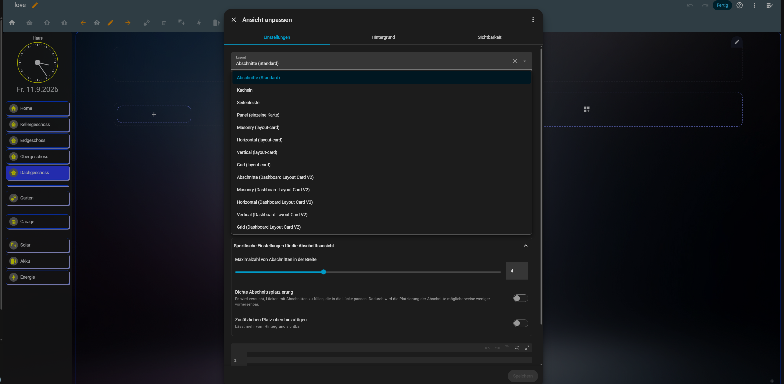

# Dashboard Layout Card V2

Parallel installable V2 fork of
[thomasloven/lovelace-layout-card](https://github.com/thomasloven/lovelace-layout-card)
with additional dashboard-view features for Home Assistant.

The original project is MIT licensed. This fork keeps attribution and registers
separate `*-v2` custom elements so it can be installed next to the original
layout-card without overwriting it.

## Features

- Adds V2 view layouts for Masonry, Sections, Horizontal, Vertical and Grid.
- Adds an optional left or right dashboard tab menu for view navigation.
- Supports non-clickable menu spacers and rounded divider bars.
- Divider bars support their own color and optional 3D frame color.
- Supports an optional bottom menu status list with up to four read-only entity values.
- Supports Home Assistant-style Sections views through `custom:sections-layout-v2`.
- Creates new dashboard subviews as Sections V2 by default.
- Keeps the menu visible while switching between linked dashboard subviews.
- Stores shared dashboard menu settings once on the home view.
- Lets linked subviews inherit menu style through `inherits_from`.
- Can apply the home view theme to linked subviews while saving.
- Supports configurable tab colors, text colors, hover colors, icon color, icon
  background color, icon shape, tab border, view card border, separate tab and
  view 3D frames, menu background, digital or analog clock, optional analog
  hour marks, minute marks and seconds hand, date display, weekday display,
  clock size and date text size.
- Can optionally hide the Home Assistant sidebar/header for selected dashboard
  users while keeping it visible for admins.

## Installation

Install this repository as a custom frontend repository in HACS:

```text
https://github.com/rockbaer2007/lovelace-layout-card-v2
```

After installation, make sure Home Assistant loads:

```text
/hacsfiles/lovelace-layout-card-v2/dashboard-layout-card-v2.js
```

If Home Assistant still shows an older version, refresh HACS repositories,
clear the browser cache and reload the dashboard.

## Registered Types

Views:

- `custom:sections-layout-v2`
- `custom:masonry-layout-v2`
- `custom:horizontal-layout-v2`
- `custom:vertical-layout-v2`
- `custom:grid-layout-v2`

Cards and helpers:

- `custom:dashboard-layout-card-v2`
- `custom:layout-card-v2`
- `custom:layout-break-v2`
- `custom:gap-card-v2`

## Dashboard View Example

The home view stores the shared dashboard configuration. Linked subviews only
reference the home view with `inherits_from`.

The optional `menu.status` block shows up to four read-only Home Assistant
entity states at the bottom of the side menu. `label` overrides the friendly
name, and `unit` is used only when the entity does not provide
`unit_of_measurement`. If `border_color` is empty, the status block uses the
tab border color; if that is empty or transparent, it falls back to white.

```yaml
views:
  - type: custom:sections-layout-v2
    path: home
    title: Home
    icon: mdi:home
    layout:
      dashboard_layout_v2:
        inherit_theme: true
        menu:
          position: left
          title: Haus
          show_home: true
          home:
            title: Home
            path: home
            icon: mdi:home
          clock: analog
          analog_hour_marks: false
          analog_minute_marks: false
          analog_seconds: false
          date: true
          weekday: long
          status:
            enabled: true
            border_color: ""
            items:
              - entity: sensor.outdoor_temperature
                label: Außen
                unit: °C
              - entity: sensor.pv_power
                label: PV
                unit: kW
          style:
            icon_color: "#fbff00"
            icon_active_color: "#ffffff"
            icon_background_color: "#ffffff"
            icon_shape: circle
            active_tab_color: "#333aff"
            inactive_tab_color: "#bfbfbf"
            hover_tab_color: "#33ffe7"
            active_tab_text_color: "#ffffff"
            inactive_tab_text_color: "#000000"
            hover_tab_text_color: "#000000"
            tab_border_color: "transparent"
            tab_shadow_frame_color: "transparent"
            card_border_color: "transparent"
            shadow_frame_color: "transparent"
            shadow_frame_offset: 4px
            clock_size: 96px
            date_size: 12px
            weekday_wrap_size: 21px
            background_mode: none
            background_color: ""
            background_image: ""
        chrome:
          hide_ha_chrome: true
          admin_always_visible: true
          visible_users: Uwe
        pages:
          - title: Kellergeschoss
            path: keller
            icon: mdi:view-dashboard
            type: custom:sections-layout-v2
            layout_type: custom:sections-layout-v2
            max_columns: 6
          - type: spacer
          - type: divider
            color: "#ffffff"
            shadow_frame_color: "transparent"
          - title: Erdgeschoss
            path: erdgeschoss
            icon: mdi:view-dashboard
            type: custom:sections-layout-v2
            layout_type: custom:sections-layout-v2
            max_columns: 4
    sections:
      - type: grid
        cards: []

  - type: custom:sections-layout-v2
    title: Kellergeschoss
    path: keller
    icon: mdi:view-dashboard
    subview: true
    layout:
      dashboard_layout_v2:
        inherits_from: home
    max_columns: 6
    sections:
      - type: grid
        cards: []

  - type: custom:sections-layout-v2
    title: Erdgeschoss
    path: erdgeschoss
    icon: mdi:view-dashboard
    subview: true
    layout:
      dashboard_layout_v2:
        inherits_from: home
    max_columns: 4
    sections:
      - type: grid
        cards: []
```

## Editor

Open the normal Home Assistant view editor and choose a V2 layout type. The V2
dashboard settings are available from the view editor and allow editing:



- menu position: left, none or right
- home entry
- whether linked subviews should inherit the home view theme
- tab pages and their layouts; new pages default to Sections V2
- new divider entries inherit colors from the previous divider
- tab, text, hover, icon and background colors
- tab/view borders and separate 3D frame colors
- shared 3D frame offset from `3px` to `10px`
- digital or analog clock
- analog hour marks, minute marks and seconds hand
- weekday display: none, short or long
- clock size from `24px` to `128px`
- date text size from `8px` to `48px`
- long weekday line break threshold from `12px` to `48px`
- Home Assistant sidebar/header visibility behavior

The JSON section in the editor is optional and meant for advanced page edits.
Normal tab changes should be done through the form fields.

## Background Images

Menu background images should be stored in Home Assistant's `www` folder and
referenced through `/local/...`.

Example:

```text
/config/www/image/back2.jpg
```

Use this path in the editor:

```text
/local/image/back2.jpg
```

For a left or right menu background, portrait images work best. A practical
target aspect ratio is about `1:2.5` (width:height). Other image shapes are
supported, but the menu uses `cover`, so wide or square images may be cropped
or feel stretched depending on the visible menu height.

Only use images you own or images with a compatible open-source/free license.
Do not redistribute screenshots, wallpapers or photos unless their license
allows it.

## Menu Settings

`dashboard_layout_v2.menu` is only needed on the home view. Subviews should use:

```yaml
layout:
  dashboard_layout_v2:
    inherits_from: home
```

This avoids duplicated style blocks and keeps tab colors consistent across all
linked dashboard pages.

## Layout Notes

The original layout-card behavior is still available through the V2 names:

```yaml
views:
  - title: Example
    type: custom:masonry-layout-v2
    layout:
      width: 300
      max_cols: 4
    cards: []
```

Inside a card:

```yaml
type: custom:layout-card-v2
layout_type: custom:grid-layout-v2
layout:
  grid-template-columns: repeat(3, minmax(0, 1fr))
  gap: 8px
cards: []
```

`view_layout` options from the original layout-card are still supported where
the inherited layout engine supports them.

## Status

This is an active V2 fork focused on dashboard-style Home Assistant views. The
API can still change while the V2 feature set is being refined.

## Attribution

Based on [thomasloven/lovelace-layout-card](https://github.com/thomasloven/lovelace-layout-card),
licensed under the MIT License.
